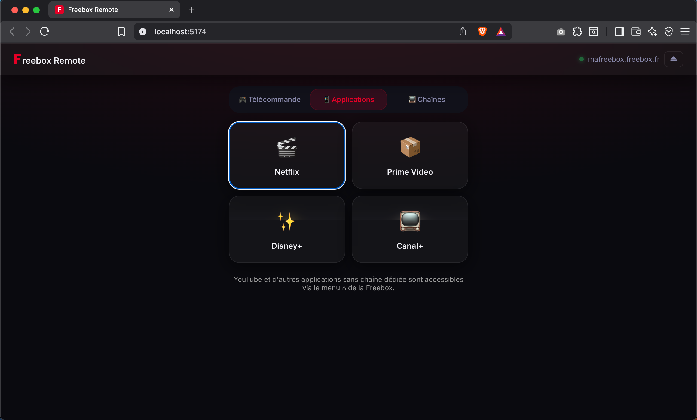
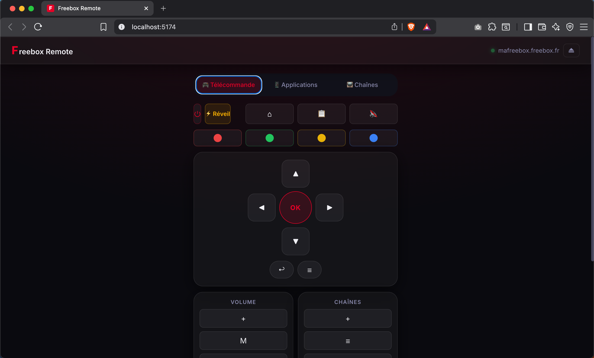

# Freebox Remote

Une interface web moderne pour contrôler votre Freebox locale (Pop, Révolution, Delta, etc.) depuis votre navigateur, avec une UI soignée en mode "Glassmorphism" et "Dark Mode".


*(Aperçu de l'interface de connexion)*


*(Télécommande complète avec onglets Apps/Chaînes)*

## Fonctionnalités 🚀

- **Authentification automatique :** Connexion sécurisée avec l'API v8 via `mafreebox.freebox.fr`.
- **Mémoire du navigateur :** Les informations de connexion et le **Code Télécommande (8 chiffres)** sont sauvegardés en local via le navigateur. Vous n'avez pas besoin de les saisir à chaque visite ! Les Freebox validées disposent même de profils enregistrés.
- **Mode Télécommande Complète :** Raccourcis pour les chaînes, contrôle du volume, PVR, touches couleurs...
- **Raccourcis Applications :** Lancement de Netflix (130), Prime Video (131) et Disney+ (132) via l'envoi rapide du numéro de canal assigné par la Freebox.

## Comment ça marche sous le capot ? ⚙️

Les versions récentes de Freebox OS bloquent les tentatives (erreur `403 Forbidden`) des applications tierces voulant lancer des applications (Netflix par ex.) ou simuler des appuis touches via la nouvelle API REST (`/api/v6/control/open`). 

Pour pallier ce fonctionnement :
1. **API Freebox OS v8** : Utilisée pour associer votre navigateur (pairage initial sur l'écran de la Freebox avec la flèche droite ▶), générer un *app_token* et un *session_token*.
2. **API Historique HD1** : La télécommande fonctionne en relayant les actions (touches et changements de chaînes) via l'ancienne API HTTP `hd1.freebox.fr` *via* un proxy Vite pour éviter les erreurs CORS. Cette méthode utilise le `Code Télécommande` à 8 chiffres trouvable sur votre télévision (`Réglages > Système`).

## Pré-requis 🛠

- Avoir **Node.js** (v16+) installé sur votre machine.
- Être branché sur le **même réseau WiFi ou LAN** que la Freebox.

## Installation et lancement 💻

1. **Cloner ou télécharger le projet**
2. **Installer les dépendances :**
   ```bash
   npm install
   ```
3. **Lancer le serveur de développement :**
   ```bash
   npm run dev
   ```
4. Ouvrez votre navigateur sur l'adresse indiquée : **[http://localhost:5174](http://localhost:5174)**.

### Où trouver le Code Télécommande ?

Sur votre TV Freebox : `Réglages` → `Système` → `Informations Freebox` → `Code télécommande`. Le code comporte 8 chiffres et doit être saisi une seule fois dans l'application : il sera ensuite sauvegardé localement.

## Sécurité & Confidentialité 🔒

L'application tourne **100% en local**. Aucun token n'est envoyé à un serveur externe. 
Votre `app_token`, votre `Code Télécommande` et l'adresse IP de votre box sont conservés uniquement dans le `localStorage` de votre navigateur vis-à-vis du même réseau.

## Déploiement en production 🌍

Si vous souhaitez héberger l'application de façon permanente, par exemple sur un Raspberry Pi :

L'application utilise actuellement de petits "Proxys Dev" inclus dans Vite (`/fbx-proxy` et `/hd1-proxy`) pour bypasser les blocages CORS du navigateur en contactant `mafreebox.freebox.fr` et `hd1.freebox.fr`. Pour un vrai déploiement, il sera nécessaire de configurer un reverse-proxy comme Nginx pour rediriger ces deux routes réseau vers les endpoints Freebox correspondants.

---
Développé avec React, TypeScript et Vite.
